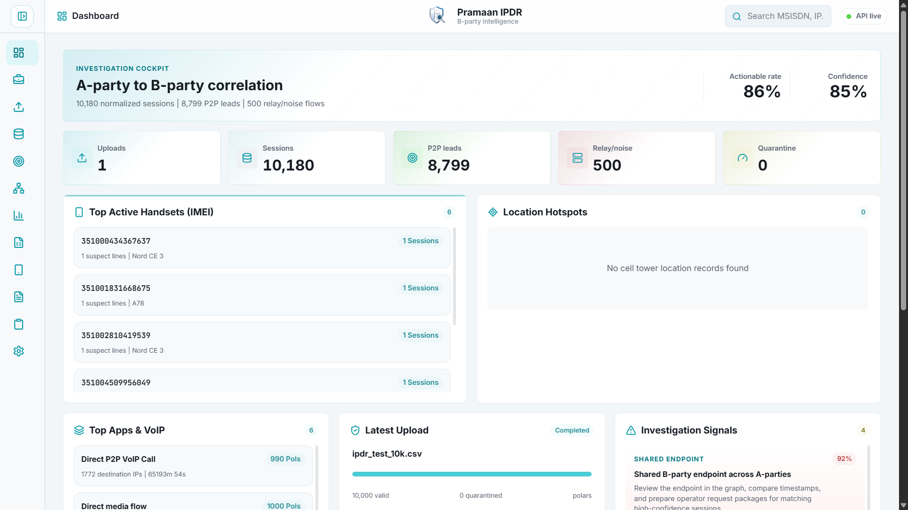
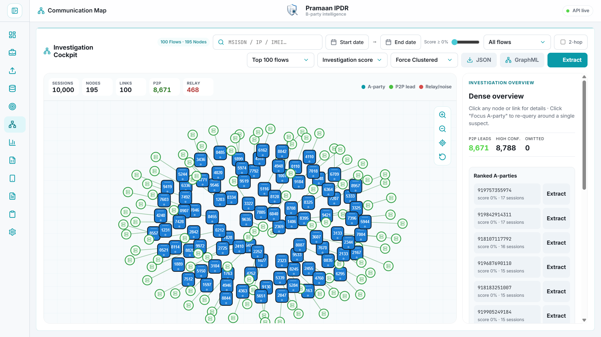
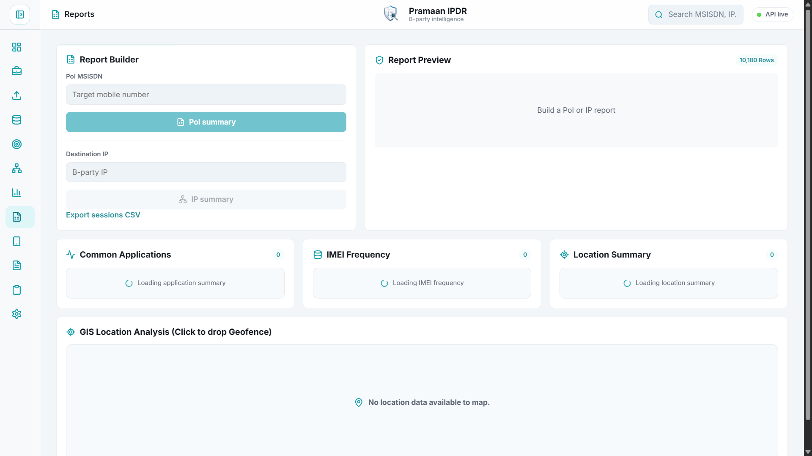
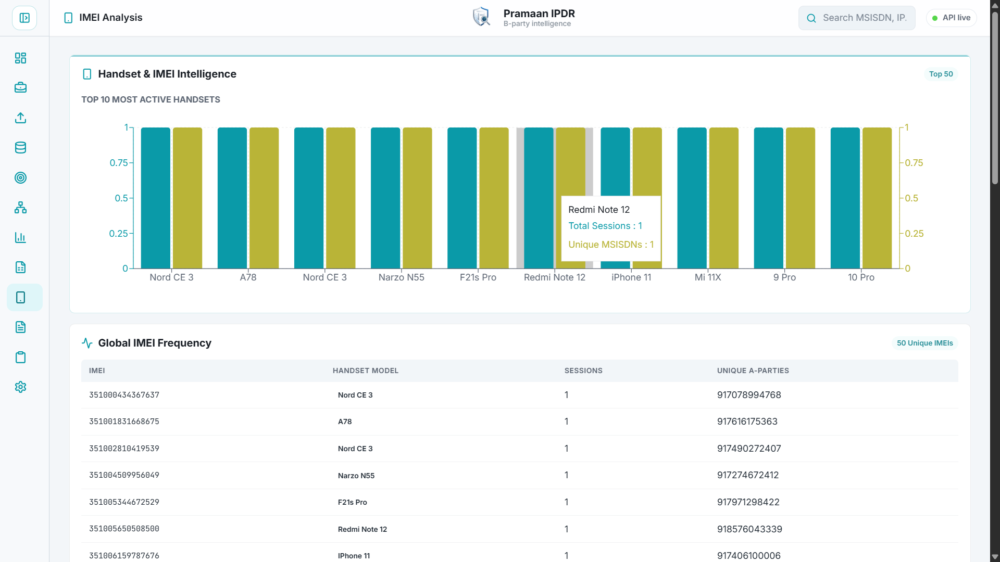
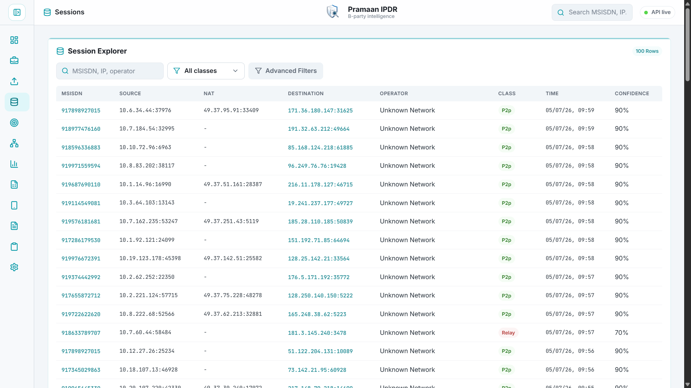
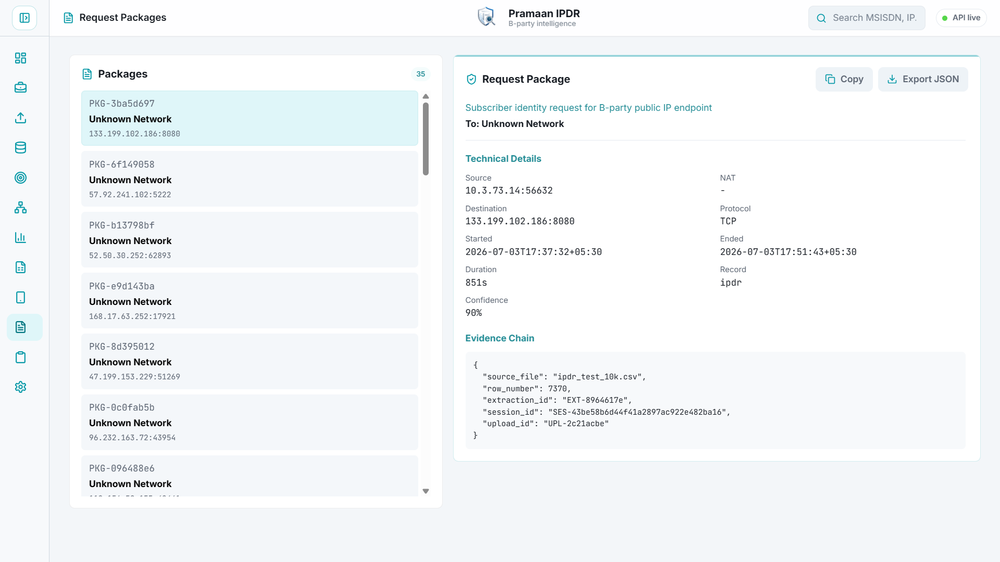
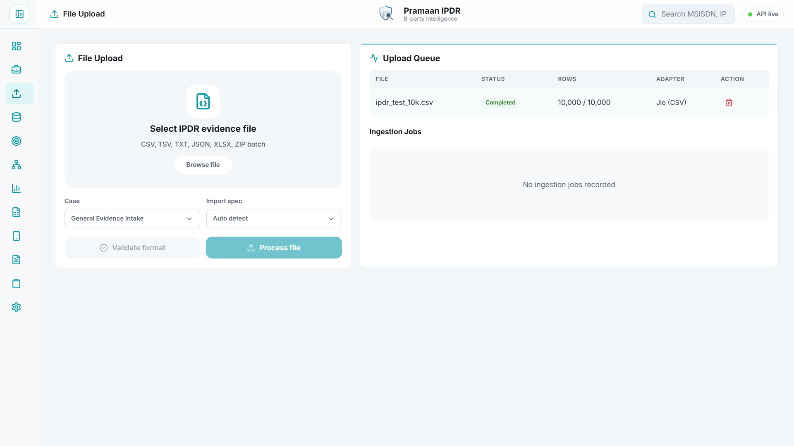
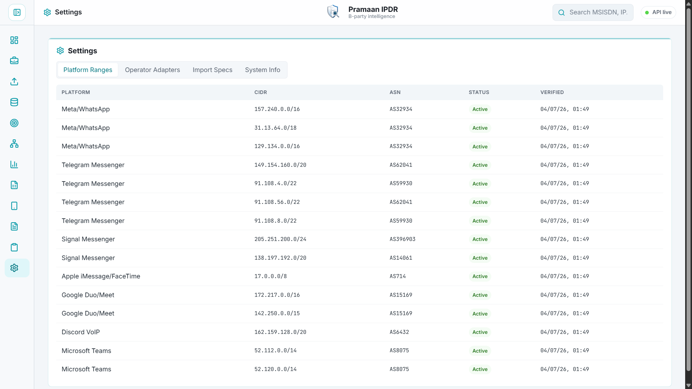
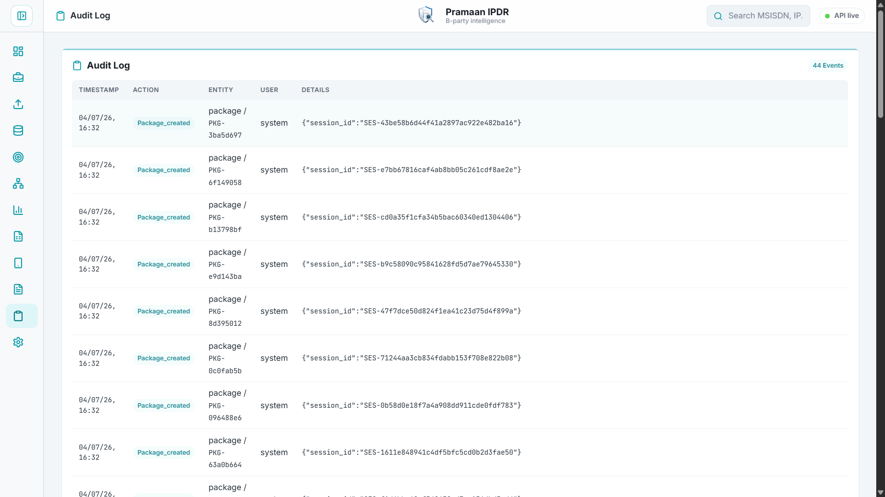

<p align="center">
  
</p>

<h1 align="center">Pramaan IPDR</h1>

<p align="center">
  <b>A State-of-the-Art B-Party Intelligence & IPDR Correlation Software for Law Enforcement</b>
</p>

<p align="center">
  
  
  
  
  
</p>

---

## About Pramaan IPDR

Pramaan IPDR is a smart investigation workflow for extracting and identifying B-party public IP addresses, mobile endpoints, and communication relationships from IPDR logs. The project is designed for law-enforcement investigation teams that need to normalize operator-provided IPDR files, map A-party to B-party interactions, reduce relay/noise traffic, and prepare actionable request packages with an auditable evidence trail.

This repository contains a working Phase 1/Phase 2 hybrid implementation with a FastAPI backend, a Vite React dashboard, persistent local evidence storage, IPDR parsing, operator format validation, case management, configurable import specifications, IP classification, extraction workflows, communication mapping, timeline analytics, investigation reports, export artifacts, and request-package generation. The latest build also includes a score-ranked Investigation Cockpit, graph clusters and insight cards, matrix view, richer PoI/IMEI/MAC reporting, fixed-line DSL IPDR normalization, polished session date-time filters, PDF/XLSX exports, upload/job deletion, persistence reset, and a generated user manual.

---

## Visual Walkthrough

### Dashboard Overview
The main dashboard displays active IMEI devices, fixed-line MAC reuse signals, cell tower location hotspots with day/night splits, active VoIP applications, and a live stream of ingested sessions.
<p align="center">
  
</p>

### Interactive Investigation Cockpit (Graph Visualizer)
A dynamic communication map displaying relationships between target MSISDNs, servers, and relays. Supports multiple layout models (Force-Directed, Concentric Radial, and symmetrical 3-Column Sankey Flow) with screen-space size preservation on zoom.
<p align="center">
  
</p>

### Person of Interest (PoI) Dossier Report
Generate summaries detailing device telemetry, application usage, and cell towers.
<p align="center">
  
</p>

### Handset and IMEI Intelligence
View global IMEI device frequencies and automatically identify shared handsets across multiple suspects.
<p align="center">
  
</p>

### Session Explorer and Advanced Parallel Filters
Query session databases and filter by IPs, Cell IDs, IMEIs, MAC addresses, access identifiers, user type, and multi-window parallel date-time slots with custom date and time pickers.
<p align="center">
  
</p>

### Fixed-Line MAC Intelligence
Review broadband/DSL evidence through MAC address reuse, access identifier overlap, source public IP rotation, and top destination pivots. This is intended for IPDR files where the A-party is a DSL/PPPoE/account identifier instead of a mobile MSISDN.


### Request Packages and Ingestion Status
Compare generated CGNAT request packages and monitor file upload status.
<p align="center">
  
  
</p>

### Custom Import Specifications and Audit Log
Manage operator column mappings, inspect active platform ranges, and review tamper-evident logs.
<p align="center">
  
  
</p>

---

## User Manual

A generated investigator-facing manual is included in the repository:

- [Pramaan IPDR User Manual](UserManual/Pramaan_IPDR.pdf)

Use this README for developer setup, architecture, API reference, data contracts, and operational limitations. Use the PDF manual as a guided application walkthrough.

---

## Problem Statement

Develop a smart tool to extract and identify B-party recipient public IP or mobile numbers from IPDR logs, enabling accurate mapping of A-party to B-party interactions for use in law-enforcement investigations.

The system focuses on the following tasks:

- Understand IPDR structures and formats across telecom operators.
- Parse large and complex IPDR files.
- Identify A-party and B-party relationships from normalized records.
- Filter irrelevant relay and platform noise where possible.
- Normalize diverse formats such as CSV, TSV, TXT, JSON, and operator-specific exports.
- Provide communication mapping through tables and graph views.
- Detect suspicious or actionable activity patterns.
- Provide search and query tools for investigators.
- Maintain security, legal compliance, and auditability.

### Current Implementation Status

This repository is a functional local implementation designed for hackathon validation, technical demonstration, and continued hardening. It persists uploaded evidence and derived records to a local JSON-backed evidence store, can write a SQLite investigation snapshot for downstream analysis, and uses deterministic synthetic fixtures for verification. It should be treated as pre-production until authentication, RBAC, approved datasets, immutable audit storage, and operator-certified adapters are added.

Implemented capabilities:

- Current graph responses include scored nodes and edges, first/last seen timestamps, cluster IDs, metadata samples, omitted node/edge counts, total source/endpoint counts, server-generated investigation insights, and view metadata describing the active graph query.
- Current frontend visualization avoids treating large IPDR graphs as a single raw hairball. It starts from ranked overview or a focused entity, then lets the investigator narrow by score, time, classification, hop depth, relay visibility, rank mode, layout, and MAC address for fixed-line broadband evidence.
- The app now includes a generated PDF user manual under `UserManual/Pramaan_IPDR.pdf`.

- FastAPI API service with health, case, import-specification, upload, session, extraction, graph, analytics, report, package, search, audit, and settings endpoints.
- Case and Upload Deletion: Fully integrated deletion workflow on both the backend and frontend. Deleting a case re-associates orphan uploads back to the default General Evidence Intake case.
- Specific Indian Operator Classification: Refined offline IP decoder from generic Indian ISP to map prefixes to specific operators: Reliance Jio (AS55836), Bharti Airtel (AS9498), and Vodafone Idea (AS55410).
- Advanced Explorer Filters: Added a slider-toggle Filters drawer in the Session Explorer to filter by Target IP, Application, Domain, Cell Tower ID, IMEI, MAC address, source public IP, access ID, user type, and Date-Time ranges in both Serial (single range) and Parallel (multiple range slots) modes. Date and time selection uses custom picker controls instead of native browser calendar widgets.
- POI App Duration Grid and Bar Chart: The PoI deep dive tab includes a Top Applications Grid (Platform, Sessions, Cumulative Duration) and a horizontal Bar Graph displaying app durations.
- IMEI Suspect Sharing Details: The Handset and IMEI Intelligence tab maps the Type Allocation Code (TAC) and displays a list of suspects sharing the same device (Used by: MSISDN1, MSISDN2).
- MAC Intelligence: Fixed-line broadband uploads now surface MAC address reuse, access identifier overlap, public source IP rotation, top destinations, suspicious reuse patterns, a dedicated MAC Intelligence page, and MAC-focused map/session pivots.
- GIS Leaflet Map Integration: Embedded the interactive Leaflet Map directly at the bottom of the Reports Builder page. It displays day/night cell tower location summaries, calculates circle radii, and filters coordinates in real-time using geofences.
- Upload Ingestion: Through a required Polars parser for CSV, TSV, TXT, JSON, Excel-style IPDR files, and ZIP batches, with automatic delimiter handling, validation-only checks, format reporting, persistence, and row quarantine reporting.
- Case-scoped evidence intake so uploads, sessions, graphs, analytics, and reports can be tied to an investigation workspace.
- Custom import specifications for operator-specific column mappings, including DoT IPDR, NAT SYSLOG, fixed-line DSL, source/private/public IP, translated, destination, MAC, IMEI, domain, and cell-location fields.
- Session normalization into a common schema covering A-party MSISDN/access identifier, source/NAT endpoints, fixed-line public source IP, true B-party destination IP/port, domain, cell ID, city/state/country, latitude/longitude, MAC address, IMEI, IMSI, protocol, bytes, and timestamps.
- Classification of likely peer-to-peer traffic, relay/platform traffic, and unknown flows.
- Known platform relay range detection for services such as WhatsApp, Telegram, and Google ranges included in the classifier.
- Operator range tagging for selected Indian telecom ranges.
- Extraction workflow for a supplied A-party MSISDN with confidence-filtered B-party candidates.
- Backend graph aggregation endpoint for visualization slices by case, focus entity, classification, hop depth, time range, score threshold, relay visibility, rank mode, and flow limit, plus JSON and GraphML export for external graph analysis.
- Investigation Cockpit UI with focus search, automatic focus-type detection, 1-hop/2-hop expansion, score threshold slider, relay/noise toggle, rank modes, top-N bounding, time windows, insight cards, cluster chips, force/concentric/Sankey/matrix views, zoom, pan, drag, fit/reset controls, node inspection, edge inspection, and extraction handoff.
- Suspicious-pattern detection for bursts, repeated direct contacts, shared endpoints, relay-heavy behavior, and quarantine review.
- Timeline analytics from year down to second-level buckets.
- Application summary and common-application reports for comparing app/destination usage across PoIs.
- PoI summary, IP summary, IMEI frequency, MAC frequency, day/night location summary, WhatsApp/Meta relay reports, common WhatsApp reports, sessions CSV/XLSX export, PoI PDF export, and CSV/HTML report exports for PoI and destination IP summaries.
- Request-package generation for actionable B-party candidates.
- Synchronous ingestion job ledger for upload status, progress, archive-member context, and error review.
- SQLite persistence snapshot endpoint for cases, uploads, ingestion jobs, sessions, reports, packages, and audit logs.
- Audit log surface for important workflow events.
- React dashboard with dashboard, cases, upload, sessions, extraction, investigation cockpit, analytics, reports, dedicated PoI dossier, IMEI intelligence, MAC intelligence, packages, audit log, and settings pages.
- App branding through Pramaan IPDR logo/favicons, Inter body font, JetBrains Mono technical font, and a restrained investigation-grade UI.
- Docker Compose wiring for API, frontend, TimescaleDB, and Redis.
- Unit and API tests for classifier, ingestion, extraction, graph, quarantine, and API behavior.

Not yet production complete:

- The JSON evidence store is still the source of truth; SQLite is currently a generated investigation snapshot, not the primary transactional database.
- Background workers are not active yet; ingestion jobs are recorded synchronously during upload processing.
- Authentication, RBAC, case-level permissions, and read-only reviewer roles are planned but not complete.
- Operator-specific adapters need real operator sample files for hardening and certification.
- Offline ASN, GeoIP, cell tower master data, TAC lookup, and MNP lookup should be populated with approved local datasets before field deployment.
- OSINT, Truecaller, deep/dark web, and third-party lookup features are not claimed in this local build because they require legal approval, licensed data, and controlled integrations.
- Legal request templates should be reviewed by the relevant department before operational use.

---

## Repository Structure

```text
.
|-- Screenshots/              # App interface screenshot directory
|-- UserManual/               # Generated investigator-facing PDF manual
|-- backend/
|   |-- app/
|   |   |-- api/              # FastAPI route definitions
|   |   |-- schemas/          # Pydantic request and response models
|   |   |-- services/         # Evidence store and IP classification logic
|   |   |-- config.py         # Environment-based settings
|   |   `-- main.py           # FastAPI application factory
|   |-- scripts/              # Utility scripts, including test IPDR fixture generation
|   |-- tests/                # Backend unit tests
|   |-- Dockerfile
|   |-- pyproject.toml
|   `-- requirements.txt
|-- frontend/
|   |-- public/               # App icon and branding assets
|   |-- src/
|   |   |-- api/              # Frontend API client
|   |   |-- App.jsx           # Main React application
|   |   |-- index.css         # Design system and layout styles
|   |   `-- main.jsx
|   |-- Dockerfile
|   |-- package.json
|   `-- vite.config.js
|-- docker-compose.yml
|-- Logo.png                  # Master branding logo
`-- README.md
```

---

## Technology Stack

Backend:

- Python 3.10 or newer required by `backend/pyproject.toml`; Python 3.11 or newer is recommended
- FastAPI
- Pydantic and pydantic-settings
- Uvicorn
- Polars and FastExcel for required upload parsing
- SQLAlchemy, asyncpg, and Alembic for the planned database layer
- Celery and Redis for the planned worker pipeline
- pyasn and GeoIP2 for offline ASN enrichment
- OpenPyXL for XLSX export
- ReportLab for PoI PDF briefs
- Pytest

Frontend:

- Node.js 20 or newer recommended
- React 19
- Vite 6
- React Router
- Framer Motion
- D3 and D3 force simulation
- TanStack Table for planned large data tables
- React Leaflet and Leaflet for location/geofence maps
- Recharts for IMEI, MAC, and report visualizations
- Lucide React icons
- Inter and JetBrains Mono font packages

Infrastructure wiring:

- Docker Compose
- TimescaleDB container for planned time-series persistence
- Redis container for planned background task coordination

---

## High-Level Workflow

1. Investigator creates or selects a case workspace.
2. Investigator optionally creates an import specification for the operator format.
3. Investigator validates an unknown operator file to confirm required fields and adapter confidence.
4. Investigator uploads an IPDR log file or ZIP batch against the case.
5. The backend parses the file and normalizes records into session objects.
6. Each session is classified as p2p, relay, or unknown using destination IP ranges, destination ports, byte counts, and operator/platform hints.
7. The dashboard presents case count, upload health, normalized sessions, candidate counts, quarantine count, and actionable rate.
8. The investigator searches or filters sessions by MSISDN/access identifier, IP, source public IP, MAC address, user type, IMEI, application, domain, cell ID, case, date range, operator, or classification.
9. The investigator opens the Investigation Cockpit to inspect ranked A-party to B-party relationships with focus search, MAC/IP/IMEI/MSISDN focus modes, score threshold, classification filter, hop depth, time window, layout mode, graph metrics, clusters, insights, node details, link evidence, matrix view, zoom, pan, and drag controls.
10. The investigator exports the active graph slice as JSON or GraphML when external analysis is needed.
11. The investigator runs extraction for an A-party MSISDN.
12. The system returns B-party candidates with evidence references and confidence.
13. Actionable candidates can be converted into request-package payloads.
14. Analytics and Reports provide timeline drill-down, suspicious-pattern review, PoI summary, IP summary, common applications, WhatsApp/Meta indicators, IMEI frequency, MAC frequency, day/night location summary, GIS/geofence view, PDF briefs, XLSX export, and CSV/HTML exports.
15. Settings can write a SQLite snapshot for local evidence review or downstream tooling.
16. Audit logs record investigation workflow events for traceability.

---

## Supported Upload Format

The parser expects delimited records with a header row, JSON records, Excel workbooks, or ZIP archives containing supported files. CSV, TSV, semicolon-delimited, pipe-delimited text, JSON arrays, XLS/XLSX files, and ZIP batches are suitable for the current implementation. Upload parsing is handled by Polars; there is no secondary CSV parser fallback. RAR archives are rejected with a clear error unless a server-side extractor is added and approved.

Required investigation columns:

| Column | Description | Example |
| --- | --- | --- |
| `msisdn` | A-party mobile number or access identifier alias | `919876543210` |
| `source_ip` | Subscriber/source IP from IPDR or NAT SYSLOG | `10.12.1.8` |
| `source_port` | Subscriber/source port | `49152` |
| `destination_ip` | True B-party destination IP | `49.36.128.45` |
| `destination_port` | True B-party destination port | `45892` |

For fixed-line ISP records, the built-in Fixed Line DSL adapter accepts `DSL User ID`, `Broadband User ID`, `PPPoE User ID`, `Radius User Name`, or similar access-account fields as the A-party identifier when no mobile MSISDN is present. Headers such as `Source Private IPv4`, `Source Public IPv4`, `Source Public IPv6`, `Mac Address`, and `User Type` are normalized into the same session schema used by mobile IPDR evidence.

Recommended DoT/NAT/fixed-line columns:

| Column | Description | Example |
| --- | --- | --- |
| `translated_ip` | NAT translated/public IP. This is not treated as B-party. | `49.37.10.21` |
| `translated_port` | NAT translated/public port | `45892` |
| `source_public_ip` | Fixed-line public source IPv4/IPv6 when supplied separately from private source IP | `103.10.20.30` |
| `started_at` or `start_date` + `start_time` | IST session start | `2026-07-03T10:01:00+05:30` |
| `ended_at` or `end_date` + `end_time` | IST session end | `2026-07-03T10:06:42+05:30` |
| `event_started_at` | Fixed-line allocation/event start time when distinct from session start | `2026-07-06T14:20:00+05:30` |
| `ip_allocation` | Static or dynamic allocation | `Dynamic` |
| `source_mac` | Customer router/ONT/CPE MAC address when present | `AA:BB:CC:DD:EE:FF` |
| `imei`, `imsi`, `sim_type` | Mobile device/SIM identifiers when available | `356789012345678` |
| `protocol` | Protocol name | `UDP` |
| `bytes_up` / `bytes_down` | Traffic counters | `182044` / `880122` |

Optional investigation-enrichment columns:

| Column | Description | Example |
| --- | --- | --- |
| `domain` | Domain or hostname when supplied by the operator | `whatsapp.net` |
| `cell_id` | Cell tower, CGI, ECGI, or other tower identifier | `404-10-12345-77` |
| `tower_name` | Tower/site label when present | `Gwalior City Site 12` |
| `city`, `state`, `country` | Decoded location fields from operator or cell master data | `Gwalior`, `Madhya Pradesh`, `India` |
| `latitude`, `longitude` | Tower or event coordinates when available | `26.2183`, `78.1828` |

These optional columns power domain filtering, cell ID filtering, day/night location summaries, and future GIS workflows. They are not required for B-party extraction because many real IPDR exports do not include decoded cell or domain information.

Important: translated_ip, public_ip, translated_port, and public_port are parsed as NAT translation fields only. They are never used as the B-party destination unless the upload also contains a real destination_ip and destination_port.

Example:

```csv
msisdn,source_ip,source_port,translated_ip,translated_port,destination_ip,destination_port,protocol,duration_seconds,bytes_up,bytes_down,started_at
919876543210,10.12.1.8,49152,49.37.10.21,45892,49.36.128.45,45892,UDP,342,182044,880122,2026-07-03T10:01:00+05:30
919876543210,10.12.1.8,49153,,,157.240.16.35,443,TCP,88,12044,42120,2026-07-03T10:05:00+05:30
```

You can generate a sample file with:

```powershell
cd backend
python scripts/generate_test_ipdr.py
```

The generated files are written to backend/tests/fixtures/ and are committed as deterministic test evidence files.

---

## Local Setup

### 1. Clone the repository

```powershell
git clone https://github.com/sillypari/CCI.git
cd CCI
```

### 2. Configure environment variables

Copy the sample environment file if you want to customize defaults:

```powershell
copy .env.example .env
```

Default backend settings:

| Variable | Default | Purpose |
| --- | --- | --- |
| `IPDR_API_PREFIX` | `/api` | API route prefix |
| `IPDR_UPLOAD_DIR` | `uploads` | Upload storage directory |
| `IPDR_MAX_UPLOAD_BYTES` | `524288000` | Maximum accepted upload size in bytes for local backend defaults. Docker Compose currently overrides this to `52428800` bytes. |
| `IPDR_CORS_ORIGINS` | `http://localhost:5173`, `http://127.0.0.1:5173` | Allowed frontend origins |

Default frontend setting:

| Variable | Default | Purpose |
| --- | --- | --- |
| `VITE_API_URL` | `/api` in the Vite app, commonly set to `http://localhost:8000/api` for separate deployments | Backend API base URL |

Note: `IPDR_CORS_ORIGINS` exists in settings, but the current development app factory allows all origins for local testing. Restrict CORS before any operational deployment.

### 3. Run the backend

```powershell
cd backend
python -m venv .venv
.\.venv\Scripts\activate
pip install -r requirements.txt
uvicorn app.main:app --reload --host 0.0.0.0 --port 8000
```

Backend URLs:

- Health check: `http://localhost:8000/health`
- API docs: `http://localhost:8000/docs`
- OpenAPI schema: `http://localhost:8000/openapi.json`

### 4. Run the frontend

Open a second terminal:

```powershell
cd frontend
npm install
npm run dev
```

Frontend URL:

```text
http://localhost:5173
```

### 5. Run the full stack with Docker Compose

```powershell
docker compose up --build
```

This starts:

| Service | URL or Port | Purpose |
| --- | --- | --- |
| Frontend | `http://localhost:5173` | React investigator UI |
| API | `http://localhost:8000` | FastAPI backend |
| TimescaleDB | `localhost:5432` | Planned persistent store |
| Redis | `localhost:6379` | Planned background jobs/cache |

---

## How to Use the Application

### Dashboard

Use the dashboard to view upload count, normalized session count, actionable candidate count, relay/noise count, quarantine count, latest upload status, and recent sessions.

### File Upload

1. Open File Upload.
2. Select or drag an IPDR-style delimited file, Excel workbook, JSON file, or ZIP batch.
3. Click Validate format to inspect detected adapter, required fields, archive members, and confidence before ingestion.
4. Click Process file.
5. Review upload status, ingestion job progress, valid rows, quarantined rows, parser report, and adapter.

For best results, use the column names or accepted aliases listed in Supported Upload Format. Invalid rows are quarantined with row-level reasons.

### Sessions

Use Sessions to inspect normalized IPDR records and verify graph or extraction leads against row-level evidence. The explorer supports:

- Global query text.
- Classification: p2p, relay, or unknown.
- A-party MSISDN.
- Destination IP.
- Operator or platform hint.
- Application hint.
- Domain or hostname.
- Cell tower or location identifier.
- IMEI.
- MAC address.
- Source public IP.
- Access ID such as DSL user ID, PPPoE user ID, or radius username.
- User type such as dynamic or static allocation.
- Serial date-time filtering with one continuous time window.
- Parallel date-time filtering with multiple independent windows for incident correlation.
- Side-by-side custom date and time pickers for advanced time-window selection.

The session table remains the source for row-level verification after graph exploration or report generation.

### B-Party Extraction

1. Open B-Party Extraction.
2. Enter the target A-party MSISDN.
3. Select extraction depth.
4. Run extraction.
5. Review returned B-party candidates, classification, confidence, and evidence.

Current extraction request shape:

```json
{
  "msisdn": "919876543210",
  "depth": 1,
  "min_confidence": 0.65
}
```

### Investigation Cockpit / Communication Map

Use the Investigation Cockpit to convert large IPDR evidence into a bounded, ranked graph slice. The goal is not to render every raw session at once. The graph should guide the investigator toward the most useful source, endpoint, cluster, or time window.

Recommended workflow:

1. Start with the ranked overview when the case is new.
2. Enter a focus value when a target is known. The UI accepts MSISDN, destination IP, IMEI, IMSI, or any-field search.
3. Use the 1-hop view for direct A-party to B-party inspection.
4. Enable 2-hop only when looking for shared endpoints or related suspects.
5. Use P2P only when looking for actionable direct B-party leads.
6. Hide or isolate relay traffic when platform infrastructure is overwhelming the view.
7. Raise the score threshold to suppress weak or repetitive noise.
8. Change rank mode depending on the investigative question: score, P2P first, confidence, volume, or recent.
9. Use time windows to analyze activity before or after a known incident.
10. Switch layout mode when needed:
   - Force Clustered for general relationship exploration.
   - Concentric Radial for source-centered review.
   - Sankey Flow for directional source-to-destination comparison.
   - Adjacency Matrix for dense cases where node-link views become unreadable.
11. Click a node or edge to inspect evidence rows, ports, app hints, confidence, score, timestamps, IMEI/IMSI samples, and request-package context.
12. Run extraction from the selected A-party or from the top-ranked source.
13. Export JSON or GraphML when the slice must be reviewed in external graph tooling.

The backend returns graph nodes, edges, metrics, clusters, insights, and view metadata. This lets the frontend display explanation panels instead of a raw hairball.

### Reports

Use Reports to build PoI MSISDN and destination IP summaries. Report previews can be exported as CSV or HTML, PoI dossiers can be exported as PDF, and normalized sessions can be exported as CSV or XLSX.

The reporting surface includes:

- PoI summary: total sessions, P2P/relay/unknown counts, first/last seen, bytes, IMEIs, top applications, and top destinations.
- Destination IP summary: source MSISDNs, ports, operator/classification, time range, total bytes, and supporting sessions.
- Common applications: app/operator usage shared across multiple PoIs.
- WhatsApp/Meta reports: PoI-specific and common WhatsApp/Meta infrastructure indicators.
- IMEI frequency: active handsets, shared devices, TAC-derived model hints, and source MSISDNs.
- Location summary: day/night tower or coordinate activity when cell/location fields are present.
- GIS map: Leaflet hotspot map with marker limits and geofence radius filtering.

### PoI Dossier

Open a PoI route from reports, session links, or a B-party destination workflow to review one suspect line in more detail. The PoI dossier aggregates:

- Top locations and day/night split.
- Associated IMEIs and handset hints.
- Top applications and cumulative duration.
- Top B-party destinations.
- WhatsApp/Meta relay activity.
- PDF export for briefing or review.
- Direct navigation back to the session evidence.

### IMEI Analysis

Use IMEI Analysis to identify device reuse across multiple A-party MSISDNs. This page is especially useful when suspects rotate SIMs but reuse the same handset.

The page includes:

- Top handset chart by sessions and unique MSISDNs.
- IMEI frequency table.
- TAC-based deterministic handset hints for demo data.
- Shared-device warning when one IMEI appears across multiple source MSISDNs.

### MAC Intelligence

Use MAC Intelligence for fixed-line broadband and DSL evidence where the customer device, CPE, ONT, or router MAC address is present in the operator IPDR. This page is useful when the same MAC appears across multiple access identifiers or public source IPs.

The page includes:

- MAC frequency chart and reuse matrix.
- Access identifiers seen behind each MAC address.
- Public source IP rotation for the same MAC.
- Top destination endpoints and first/last seen timestamps.
- Direct pivots back into session evidence and MAC-focused graph views.

### Request Packages

Use Request Packages to review generated payloads for actionable candidates. These payloads collect the target operator, destination endpoint, timestamp, protocol, classification, confidence, and evidence chain.

These packages are technical payloads and should be reviewed against departmental legal templates before operational use.

### Audit Log

Use Audit Log to review workflow events. In production, this surface should be tied to authenticated users, case IDs, and immutable storage.

### Settings

Use Settings to manage technical investigation configuration:

- Platform ranges used by relay/noise classification.
- Import specifications for operator-specific headers.
- Operator/classifier information.
- SQLite evidence snapshot creation.
- Persistence reset for local development or demonstration cleanup.

Do not reset persistence in an operational case unless evidence retention and chain-of-custody requirements allow it.

---

## Large Graph Strategy

IPDR data can grow from thousands to millions of rows. A professional investigation tool should not draw every row as a visible node-link diagram. Pramaan IPDR follows the same principles used by serious graph-analysis systems:

| Principle | Implementation in Pramaan IPDR |
| --- | --- |
| Aggregate before rendering | The backend groups sessions into source-to-destination edges and samples evidence rows per edge. |
| Focus first | `/api/graph` accepts `focus` and `focus_type` so investigators can start from an MSISDN, IP, IMEI, IMSI, MAC address, or broad search value. |
| Bound the slice | `limit` and `scan_limit` prevent the frontend from receiving unbounded graph payloads. |
| Rank by investigation value | `rank_by=score` combines confidence, class, repeat activity, bytes, duration, shared endpoints, and night activity. Other modes include `p2p`, `confidence`, `volume`, and `recent`. |
| Suppress noise | `include_relay=false`, classification filters, and score thresholds reduce platform relay clutter. |
| Expand progressively | `hops=1` shows direct relationships; `hops=2` expands to related sources/endpoints only when needed. |
| Preserve evidence | Nodes and edges include sampled source sessions with row numbers, source files, ports, timestamps, app hints, and confidence. |
| Explain the view | Graph responses include clusters, insights, omitted edge/node counts, score fields, and view metadata. |
| Offer alternate views | Dense cases can be reviewed through graph layouts or adjacency matrix mode. |
| Export the slice | JSON and GraphML exports preserve the active filters for external graph tools. |

For investigation work, the recommended first screen is a ranked overview or focused entity view, not the whole database. Raw session rows remain available in Sessions and Reports for verification.

---

## API Reference

Base URL in local development:

```text
http://localhost:8000/api
```

| Method | Endpoint | Purpose |
| --- | --- | --- |
| `GET` | `/dashboard/stats` | Dashboard metrics, case count, crime-type counts, and latest upload summary |
| `GET` | `/cases` | List investigation cases |
| `POST` | `/cases` | Create an investigation case |
| `DELETE` | `/cases/{case_id}` | Delete a non-protected case and move uploads back to General Evidence Intake |
| `GET` | `/import-specs` | List configurable operator import specifications |
| `POST` | `/import-specs` | Create a custom import specification |
| `GET` | `/uploads` | List upload records |
| `GET` | `/uploads/jobs` | List synchronous ingestion jobs |
| `GET` | `/uploads/jobs/{job_id}` | Read one ingestion job |
| `DELETE` | `/uploads/jobs/{job_id}` | Delete one ingestion job record |
| `DELETE` | `/uploads/jobs` | Clear ingestion job history |
| `POST` | `/uploads/validate` | Validate file format and required fields without committing sessions |
| `POST` | `/uploads/auto-suggest-mapping` | Suggest canonical mappings from uploaded operator headers |
| `POST` | `/uploads` | Upload an IPDR file as multipart form data, optionally with `case_id` and `import_spec_id` |
| `DELETE` | `/uploads/{upload_id}` | Delete an upload and remove its associated sessions/evidence |
| `GET` | `/uploads/{upload_id}/status` | Read upload processing status |
| `GET` | `/uploads/{upload_id}/quarantine` | List row-level quarantine reasons for an upload |
| `GET` | `/sessions` | List normalized sessions with filters for case, MSISDN/access ID, class, destination IP, source public IP, MAC, user type, IMEI, app, domain, cell ID, and date range |
| `GET` | `/sessions/{session_id}` | Read a single session |
| `GET` | `/graph` | Return backend-aggregated graph nodes, links, sessions, and metrics |
| `GET` | `/graph/export.json` | Export a graph slice as JSON |
| `GET` | `/graph/export.graphml` | Export a graph slice as GraphML |
| `GET` | `/analytics/patterns` | List suspicious investigation signals detected from uploaded evidence |
| `GET` | `/analytics/timeline` | Return year/month/day/hour/minute/second timeline buckets |
| `GET` | `/analytics/applications` | Return application frequency and duration summary |
| `POST` | `/extract` | Run B-party extraction for a supplied MSISDN |
| `GET` | `/extractions` | List extraction results |
| `GET` | `/extractions/{extraction_id}` | Read a single extraction result |
| `GET` | `/reports/poi/{msisdn}` | Preview PoI MSISDN summary report |
| `GET` | `/reports/ip/{destination_ip}` | Preview destination IP summary report |
| `GET` | `/reports/common-applications` | List applications/destination IPs shared across PoIs |
| `GET` | `/reports/imei-frequency` | List IMEI frequency and shared-handset evidence |
| `GET` | `/reports/mac-frequency` | List MAC address frequency, access identifier reuse, public source IP rotation, and top destinations |
| `GET` | `/reports/location-summary` | List cell/location day-night summaries when location columns exist |
| `GET` | `/reports/poi/{msisdn}.csv` | Export a PoI summary as CSV |
| `GET` | `/reports/poi/{msisdn}.html` | Export a PoI summary as HTML |
| `GET` | `/reports/poi/{msisdn}.pdf` | Export a PoI brief as PDF |
| `GET` | `/reports/ip/{destination_ip}.csv` | Export a destination IP summary as CSV |
| `GET` | `/reports/ip/{destination_ip}.html` | Export a destination IP summary as HTML |
| `GET` | `/reports/whatsapp/{msisdn}` | List WhatsApp/Meta-related sessions for one PoI |
| `GET` | `/reports/common-whatsapp` | List common WhatsApp/Meta application indicators across PoIs |
| `GET` | `/reports/sessions.csv` | Export normalized sessions as CSV |
| `GET` | `/reports/sessions.xlsx` | Export normalized sessions as XLSX |
| `GET` | `/packages` | List generated request packages |
| `GET` | `/audit-logs` | List audit log events |
| `GET` | `/search` | Search sessions, uploads, and packages |
| `GET` | `/persistence/status` | Read local persistence snapshot status |
| `POST` | `/persistence/snapshot` | Write or refresh the SQLite evidence snapshot |
| `POST` | `/persistence/reset` | Reset local persistence and clear records back to zero |
| `GET` | `/platform-ranges` | List configured platform ranges |
| `POST` | `/platform-ranges` | Add a platform range |

### Graph Query Parameters

`GET /api/graph`, `/api/graph/export.json`, and `/api/graph/export.graphml` share the same investigation filter contract.

| Parameter | Values | Purpose |
| --- | --- | --- |
| `focus` | string | Entity value to start from, such as MSISDN/access ID, destination IP, IMEI, IMSI, MAC address, or free text. |
| `focus_type` | `msisdn`, `ip`, `endpoint`, `imei`, `imsi`, `mac`, `any` | Tells the backend how to interpret `focus`. |
| `classification` | `p2p`, `relay`, `unknown` | Restricts graph sessions to one classification. Omit for all classes. |
| `case_id` | case ID | Restricts graph analysis to one investigation case. |
| `limit` | 1 to 5000 | Maximum visible graph edges returned. The UI defaults to bounded top slices. |
| `scan_limit` | 1 to 100000 | Maximum sessions scanned server-side before ranking. |
| `hops` | 1 or 2 | Uses direct neighborhood or related two-hop neighborhood around the focus entity. |
| `include_relay` | `true` or `false` | Includes or suppresses relay/noise traffic. |
| `min_score` | 0.0 to 1.0 | Hides low-priority edges below the investigation score threshold. |
| `rank_by` | `score`, `volume`, `confidence`, `recent`, `p2p` | Sorts candidate edges according to the current investigation question. |
| `started_from` | ISO datetime | Lower time bound for sessions. |
| `started_to` | ISO datetime | Upper time bound for sessions. |

Example focused graph query:

```powershell
curl.exe "http://localhost:8000/api/graph?focus=919876543210&focus_type=msisdn&hops=1&classification=p2p&rank_by=score&limit=100"
```

Example dense-case query with relay suppression and score threshold:

```powershell
curl.exe "http://localhost:8000/api/graph?include_relay=false&min_score=0.45&rank_by=p2p&limit=250"
```

Example MAC-focused graph query:

```powershell
curl.exe "http://localhost:8000/api/graph?focus=AA:BB:CC:DD:EE:FF&focus_type=mac&hops=1&limit=100"
```

Graph response highlights:

- `nodes`: A-party and endpoint nodes with `score`, `cluster_id`, first/last seen timestamps, sampled sessions, and metadata.
- `links`: Aggregated source-to-destination edges with classification, counts, bytes, duration, confidence, score, timestamps, sampled sessions, and metadata.
- `metrics`: Visible node/edge counts, scanned sessions, omitted node/edge counts, source/endpoint totals, class counts, high-confidence count, and first/last seen timestamps.
- `clusters`: Server-side groups such as A-parties, direct P2P leads, Meta/WhatsApp, relay/noise, unknown endpoints, or operator clusters.
- `insights`: Ranked investigation hints such as top source, shared endpoint, or relay concentration.
- `view`: The normalized query contract used to generate the graph.

Example upload request:

```powershell
curl.exe -X POST "http://localhost:8000/api/uploads" `
  -F "file=@backend/tests/fixtures/valid_ipdr.csv"
```

Example extraction request:

```powershell
curl.exe -X POST "http://localhost:8000/api/extract" `
  -H "Content-Type: application/json" `
  -d "{\"msisdn\":\"919876543210\",\"depth\":1,\"min_confidence\":0.65}"
```

Example session query:

```powershell
curl.exe "http://localhost:8000/api/sessions?msisdn=919876543210&classification=p2p&limit=50"
```

Example fixed-line session query:

```powershell
curl.exe "http://localhost:8000/api/sessions?source_mac=AA:BB:CC:DD:EE:FF&source_public_ip=103.10.20.30&user_type=Dynamic"
```

Example MAC frequency report:

```powershell
curl.exe "http://localhost:8000/api/reports/mac-frequency?limit=20"
```

---

## Classification Logic

The current classifier is intentionally simple and explainable for Phase 1.

Classification outcomes:

| Class | Meaning |
| --- | --- |
| `p2p` | Likely direct peer-to-peer or direct media flow candidate |
| `relay` | Likely platform relay, STUN/TURN signalling, or known relay infrastructure |
| `unknown` | Insufficient evidence or invalid/unmapped destination |

Main signals used today:

- Destination IP validity.
- Known relay CIDR ranges for supported platforms.
- Destination port patterns such as STUN/TURN-related ports.
- Download byte count and high destination port behavior.
- Operator IP range mapping.

The classifier should be extended with operator-specific field mappings, verified platform ASN/range feeds, temporal correlation, NAT behavior, and confidence scoring calibrated against real investigation samples.

---

## Enrichment and Data Boundaries

The current build supports enrichment, but approved production datasets are still required for field deployment.

| Area | Current behavior | Production requirement |
| --- | --- | --- |
| ASN/IP decode | Loads local `rib.dat`, GeoLite2, and `platform_asns.json` if available. Falls back to deterministic demo prefix handling when datasets are absent. | Use approved offline ASN, GeoIP, and operator range datasets with update procedures. |
| Platform relay detection | Uses configured platform ranges and known demo/platform mappings for services such as Meta/WhatsApp, Telegram, Google, and custom ranges. | Maintain legally approved, versioned relay and platform infrastructure ranges. |
| TAC/handset lookup | Uses deterministic demo TAC hints in `tac_decoder.py`. | Replace with licensed or department-approved TAC database. |
| Cell location lookup | Uses supplied latitude/longitude when present and deterministic demo coordinates for cell IDs when needed. | Replace with official cell tower master data and operator-provided site metadata. |
| Operator adapters | Includes canonical and operator-shaped mappings for DoT IPDR, NAT SYSLOG, Fixed Line DSL, Airtel, Jio, Vodafone Idea, BSNL, and generic uploads. | Validate against real sanitized operator samples and update import specifications. |
| External enrichment | No uncontrolled third-party OSINT or caller-ID integrations are claimed. | Add only after legal approval, audit controls, and data-source licensing. |

Synthetic fixtures under `backend/tests/fixtures/` are for validation and demonstration. Do not commit real IPDR logs, subscriber records, or live investigation exports.

---

## Testing

Run backend tests:

```powershell
cd backend
pytest
```

Run frontend production build:

```powershell
cd frontend
npm run build
```

Recommended pre-push check:

```powershell
cd backend
pytest
cd ..\frontend
npm run build
```

---

## Security and Legal Considerations

IPDR data can contain sensitive personal information. Treat every upload and derived result as restricted investigation material.

Operational recommendations before production use:

- Add authentication and role-based access control.
- Enforce case-level access boundaries.
- Encrypt uploads and extracted artifacts at rest.
- Use TLS in all deployed environments.
- Restrict CORS in deployed environments; the current app factory is permissive for local development.
- Store audit logs in append-only or tamper-evident storage.
- Redact personal data in non-production logs.
- Do not commit real IPDR files, subscriber data, or investigation exports.
- Validate request-package formats with the relevant legal authority before use.
- Establish retention, deletion, and chain-of-custody procedures.

---

## Development Roadmap

Recommended next milestones:

1. Replace the JSON source-of-truth store with SQLAlchemy async models and Alembic migrations while keeping the SQLite snapshot as an export artifact.
2. Persist uploads, normalized sessions, extractions, request packages, reports, import specifications, and audit logs in TimescaleDB/PostgreSQL.
3. Add Redis-backed Celery or RQ workers for large-file parsing.
4. Add streaming ingestion with Polars for very large operator files and benchmark import throughput against the target 2500+ records per second.
5. Harden operator adapters for Jio, Airtel, Vodafone Idea, BSNL, and other required formats using real sanitized samples.
6. Add authentication, RBAC, case-level permissions, read-only reviewers, and module-level access controls.
7. Add approved offline datasets for ASN/IP decode, GeoIP, cell tower master data, TAC/handset lookup, and MNP lookup.
8. Add i2 Analyst's Notebook-compatible export, map/image export, and department-approved PDF/Excel report templates.
9. Harden deployment with secrets management, TLS, backups, disaster recovery, observability, and tamper-evident audit storage.

---

## Troubleshooting

### Backend does not start

Check that the virtual environment is active and dependencies are installed:

```powershell
cd backend
.\.venv\Scripts\activate
pip install -r requirements.txt
uvicorn app.main:app --reload
```

### Frontend cannot reach the API

Confirm the backend is running:

```powershell
curl.exe http://localhost:8000/health
```

If the API is hosted on a different URL, set `VITE_API_URL` before running the frontend.

### Upload returns invalid or quarantined rows

Confirm the file has a header row and includes the expected columns. Start with `backend/tests/fixtures/valid_ipdr.csv` or regenerate fixtures with `python backend/scripts/generate_test_ipdr.py` if you need a known-good sample.

### Docker Compose port conflict

If ports `5173`, `8000`, `5432`, or `6379` are already in use, stop the conflicting service or edit `docker-compose.yml` port mappings.

---

## License and Usage Notice

A license file is not currently included. Add the intended license before public distribution or reuse.

This project is built for lawful investigation workflows. It must be deployed and used only under applicable legal authority, departmental policy, and evidence-handling procedures.
